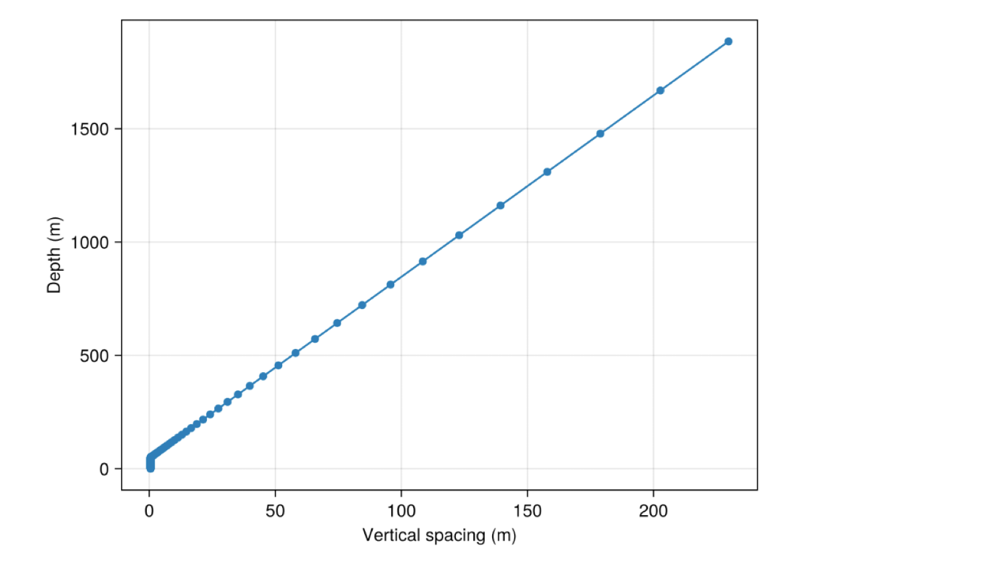

# Setup of 2D tilted boundary model

- *listing modifications made from original code at https://github.com/CliMA/Oceananigans.jl/blob/main/examples/tilted_bottom_boundary_layer.jl.*

**Grid:** 

- 2000m depth, 200m width 
- Stretched grid, 0.5m at the bottom.

**Boundary Conditions**
- no slip 
- no flux

